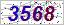

##YuYingjian.SimpleCaptcha
A simple captcha library for .NET

visual studio 2013编写 .net framework 4.5.1



###Example
```cs
            //主要代码
			Captcha.CodeLength = 4;
            Captcha.FontSize = 16;
            Captcha.Height = 25;
            Captcha.Width = Captcha.CodeLength * Captcha.FontSize;

            var captcha = new Captcha();
            var code = captcha.Code;	//code存储到加密cookie中以备验证之用 自己搞定吧
            var imageBytes = captcha.ImageBytes;

			//输出到htpp流
            context.Response.ContentType = "image/jpeg";

            var imageBytesLength = imageBytes.Length;

            const int size = 4096;
            int offset = 0;
            while (imageBytesLength > 0)
            {
                if (imageBytesLength > size)
                {
                    context.Response.OutputStream.Write(imageBytes, 0, size);
                    offset += size;
                    imageBytesLength -= size;
                }
                else
                {
                    context.Response.OutputStream.Write(imageBytes, offset, imageBytesLength);
                    imageBytesLength = 0;
                }
            }
```
